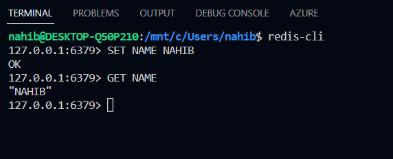

# Project Installation

```bash
  git clone https://github.com/MHNahib/redis-poc.git
  cd redis-poc
  npm i
```

## Run project

```bash
  npm start
```

# Redis

## Install Redis

```bash
sudo apt install redis
```

## Start redis

```bash
reids-server
```

## Access redis

```bash
redis-cli
```

## How redis works

- Works as Key value pair
- It primarily works with strings

```bash
# SET key value
SET name Nahib

# GET key
GET name
```



```bash
EXISTS KEY

# Returns 0 if it is not their
# Returns 1 if it is their
```


```bash
# To see all the values in redis
KEYS *
```


```bash
# To remove all the values in redis
flushall
```


```bash
# set expire time in seconds
expire key seconds

# check how many time left to expire
ttl key

# set time when initialize
setex key seconds value
```


```bash
# List -> like array

# create a new list
lpush/ rpush key value

# left push
lpush key value

# right push
rpush key value

# left pop
lpop key

# right pop
rpop value

# show the full list
lrange key
```


```bash
# set -> only unique values will be stored

# add value in set

sadd memberName value

# delete value in set

srem memberName value

# show set

smembers membersName
```


